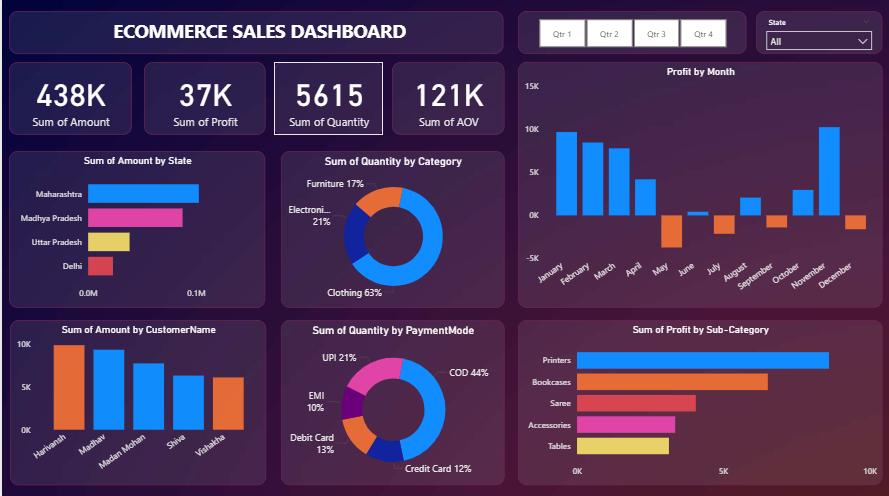

# 📊 Power BI E-Commerce Sales Dashboard

## Project Overview  
This project is an interactive **Power BI dashboard** built to analyze **e-commerce sales performance** across multiple business dimensions such as **revenue, profit, quantity sold, customer behavior, product categories, payment modes, and regional performance**.

The dashboard provides both **high-level KPIs** and **detailed analytical insights** to help stakeholders understand sales trends and make data-driven decisions.

---

## Objectives  
The main objectives of this project are:

- To track overall **sales revenue and profit**
- To analyze **product category performance**
- To identify **top-performing states and customers**
- To understand **monthly profit trends**
- To analyze customer behavior by **payment mode**
- To enable **interactive quarterly and state-wise analysis**

---

## Dashboard Overview  

The dashboard consists of multiple sections:

### Key Performance Indicators (KPIs)
- **Sum of Amount** – Total sales revenue  
- **Sum of Profit** – Total profit generated  
- **Sum of Quantity** – Total items sold  
- **Sum of AOV** – Average Order Value  

---

### Visual Analytics  

#### 1. Sales by State  
Bar chart showing **sum of sales amount by state**, helping identify top-performing regions.

#### 2. Sales by Category  
Donut chart displaying **quantity distribution by product category**:
- Clothing  
- Electronics  
- Furniture  

#### 3. Profit by Month  
Column chart showing **monthly profit trend**, highlighting seasonal variations and low-performing months.

#### 4. Sales by Customer  
Bar chart showing **top customers by sales amount**.

#### 5. Quantity by Payment Mode  
Donut chart analyzing **customer payment preferences**:
- COD  
- UPI  
- Credit Card  
- Debit Card  
- EMI  

#### 6. Profit by Sub-Category  
Horizontal bar chart showing **profit contribution by product sub-category** such as:
- Printers  
- Bookcases  
- Accessories  
- Tables  

---

## Dashboard Screenshot  

### E-Commerce Sales Dashboard  
Interactive dashboard with KPIs, charts, and slicers for quarterly and state-wise analysis.  

---

## Key Features  

- Dynamic slicers for:
  - **Quarter (Q1–Q4)**
  - **State**
- KPI-based executive reporting  
- Monthly trend analysis  
- Customer-level performance tracking  
- Payment mode behavioral analysis  
- Clean and modern dashboard UI  

---

## Business Use Cases  

This dashboard can be used for:

- Sales performance monitoring  
- Regional market analysis  
- Customer segmentation  
- Marketing strategy planning  
- Product category optimization  
- Revenue and profit tracking  

---

## Tools & Technologies  

- **Power BI Desktop**
- **DAX (Data Analysis Expressions)**
- **Power Query (ETL)**
- Data modeling and relationships  
- Interactive visual analytics  

---

## Data Model  

The dataset includes the following key fields:

- `Order_Date`  
- `State`  
- `Customer_Name`  
- `Category`  
- `Sub_Category`  
- `Payment_Mode`  
- `Quantity`  
- `Amount`  
- `Profit`  
- `AOV`  

---

## Key Learnings  

Through this project, I gained hands-on experience in:

- Designing business-focused dashboards  
- Building executive KPI reports  
- Writing DAX measures for sales metrics  
- Performing customer and product analysis  
- Creating interactive analytical views  

---

## Future Enhancements  

- Add YoY and MoM growth analysis  
- Implement customer lifetime value (CLV)  
- Add forecasting models  
- Include discount and margin analysis  
- Publish to Power BI Service  

---

## Author  

**Mohammad Sayam Fareez**  
Aspiring Data Analyst | Power BI Developer  
Electronics Engineering Graduate (2025)

